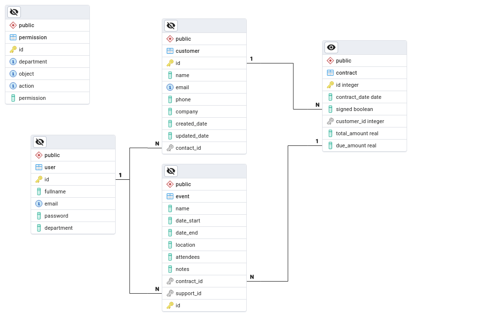

# EPIC-CRM System

------------------
<h3 align="center">
    
    <br>
</h3>

# OpenClassrooms - Formation Développeur d'application Python - Projet 12

## Développez une architecture back-end sécurisée avec Python et SQL

## Le projet 
Ce système CRM (Gestion de la Relation Client) offre des fonctionnalités pour la gestion des utilisateurs, des clients, des contrats et des événements. Les utilisateurs peuvent effectuer diverses actions en fonction de leur département et des permissions qui leur sont accordées.

<p align="right">(<a href="#top">back to top</a>)</p>

## Shema de la base de données
<h3 align="center">
    
    <br>
</h3>

## Installaltion du SGBD Postgresql
Pour installer, configurer Postgresql vous pouvez suivre de consulter [Pour installer, configurer Postgresql](assets/installation.md) et [le site officiel](https://www.postgresql.org/)
## Recuperation du code
1. <a href="#python-installation">Installation Python</a> ;
2. Cloner le projet  ;
```bash
   git clone https://github.com/MohandArezki/P12_MohandArezki_Lahlou.git
``` 
3. Créer l'environnement virtuel *(plus de détails  [Creating a virtual environment](https://packaging.python.org/en/latest/guides/installing-using-pip-and-virtual-environments/#creating-a-virtual-environment))* ;
```bash   
    python3 -m venv env
```   
4. Activer l'environnement virtuel :
```bash
    source env/bin/activate
```      
5. Installer les packages necessaires;
```bash   
   pip install -r requirements.txt
```
6. Accéder au dossier du projet ;
```bash
   cd path/to/projet
```
7. Pour generer des données pour les tests, excecuter le programm 
```bash   
   python3 generate_fake.py 
```

8. Excecuter le programm 
```bash   
   python3 main.py 
```
<p align="right">(<a href="#top">back to top</a>)</p>

## Exploitation

Pour répondre au cahier des cahiers des charges, ci-dessous les commandes implementées :
#### login
1. Descritpion: Se connecter à l'application
2. Usage: `login -email <email>`
3. Exemple: Connexion en tant que "manager".
```bash
____________________________________________________________________________________________________
________________________________________ Welcome - EPIC-CRM ________________________________________
 [-] Type command >> login -email admin@epic.com
 -----User (admin@epic.com) authentication -----
 Password: ************
 User [1] - admin authenticated successfully.
____________________________________________________________________________________________________
________________________________________ Welcome - EPIC-CRM ________________________________________
 [-] Connected User: [1] - admin
 [-] Type command >> 
```
<p align="right">(<a href="#top">back to top</a>)</p>

#### help
1. Description: Afficher l'aide pour une commande
2. Usage: `help [commande]`
3. Exemple: Afficher l aide pour la commande "login"
```bash
____________________________________________________________________________________________________
________________________________________ Welcome - EPIC-CRM ________________________________________
 [-] Connected User: [1] - admin
 [-] Type command >> help login
  Help for the 'login' command:
   Log in to the application
   Usage: login -email <email>
  This command allows you to log in to the application by providing an email address.
```  
<p align="right">(<a href="#top">back to top</a>)</p>

#### activate
1. Descritpion: Sélectionner une entité
2. Usage: `activate [-object <entité>] -id <identifiant> `
3. Exemple: Sélection d un contrat
```bash
____________________________________________________________________________________________________
________________________________________ Welcome - EPIC-CRM ________________________________________
 [-] Connected User: [1] - admin
 [-] Type command >>  activate -object contract -id 10
Token checked. Still valid.
Checking permissions for | User: [1] - admin | Action: Read | Object: Contract | Instance: [10] .
User has the required authorization.
____________________________________________________________________________________________________
________________________________________ Welcome - EPIC-CRM ________________________________________
 [-] Connected User: [1] - admin
 [-] Contract: [10] 
 [-] Type command >> 
```   
<p align="right">(<a href="#top">back to top</a>)</p>

#### deactivate
1. Descritpioin: ferme une entité
2. Usage: `deactivate [-object <entité>] -id <identifiant>  `
3. Exemple : 
```bash
____________________________________________________________________________________________________
________________________________________ Welcome - EPIC-CRM ________________________________________
 [-] Connected User: [1] - admin
 [-] Contract: [10] 
 [-] Type command >> deactivate
Token checked. Still valid.
Checking permissions for | User: [1] - admin | Action: Read | Object: Contract.
User has the required authorization.
____________________________________________________________________________________________________
________________________________________ Welcome - EPIC-CRM ________________________________________
 [-] Connected User: [1] - admin
 [-] Type command >> 
```    
#### create
1. Description: Créer une nouvelle entité
2. Usage: `create [-object <entité>]`
3. Exemple: Creation d un nouvel utilisateur 
```bash
____________________________________________________________________________________________________
________________________________________ Welcome - EPIC-CRM ________________________________________
 [-] Connected User: [1] - admin
 [-] Type command >> create
 Checking permissions for | User: 1 - admin | Action: Create | Object: User.
 User has the required authorization.
 ----------------------- Creating user -----------------------
 Fullname : John Doe
 Email : jd@epic.com
 Department M,C,S : M
 Password : **********
 Confirm password : *********
 User '25 - John Doe' created successfully.
```
<p align="right">(<a href="#top">back to top</a>)</p>

#### update
1. Description: Modification d une entité   
2. Usage: `update [-object <entité>] -id <identifiant>]`
3. Exemple: Mise a jour des informations d un contract.
```bash
____________________________________________________________________________________________________
________________________________________ Welcome - EPIC-CRM ________________________________________
 [-] Connected User: [1] - admin
 [-] Type command >> update -id 5
Token checked. Still valid.
Checking permissions for | User: [1] - admin | Action: Update | Object: User | Instance: [5] - Lori Hanson.
User has the required authorization.
 ----------------------- Updating user -----------------------
 Fullname (Lori Hanson): John Doe
 Email (commercial_1@epic.com):  Department M,C,S (C):  Password : 
 Confirm password : 
User '[5] - John Doe' updated successfully.
____________________________________________________________________________________________________
________________________________________ Welcome - EPIC-CRM ________________________________________
 [-] Connected User: [1] - admin
 [-] Type command >> 
```
<p align="right">(<a href="#top">back to top</a>)</p>

#### delete: 
1. Description: Supprimer des entités
2. Usage: `delete [-object <entité>] -id <identifiant>]`
3. Exemple: suppression d un client.
3.1 Suppression d un client par un utilisateur de l equipe de gestion 
```bash
________________________________________ Welcome - EPIC-CRM ________________________________________
 [-] Connected User: [1] - admin
 [-] Commercial: [5] - John Doe
 [-] Customer: [16] - Entoine Rael
 [-] Type command >> delete
Token checked. Still valid.
Checking permissions for | User: [1] - admin | Action: Delete | Object: Customer | Instance: [16] - Entoine Rael.
User has the required authorization.
customer [16] - Entoine Rael deleted successfully.
____________________________________________________________________________________________________
________________________________________ Welcome - EPIC-CRM ________________________________________
 [-] Connected User: [1] - admin
 [-] Commercial: [5] - John Doe
 [-] Type command >> 
 ```
<p align="right">(<a href="#top">back to top</a>)</p>

#### display
1. Description: Affichage des informations
2. Usage: `display [-object <entité>] [-filter <filtre>] [-mode <type d affichage>]`
3.1 Exemple: Affichage des cntrats signés d un commercial (-mode list)
```bash
________________________________________ Welcome - EPIC-CRM ________________________________________
 [-] Connected User: [1] - admin
 [-] Commercial: [5] - John Doe
 [-] Type command >> display -object contract -filter signed
Token checked. Still valid.
Checking permissions for | User: [1] - admin | Action: Read | Object: Contract.
User has the required authorization.
+--------------------------------------------------------------------------------------------------+
|                      Used filter (And(Commercial = [5] - John Doe) signed )                      |
+---+----+------------+--------+----------------------+----------------+--------------+------------+
| # | ID |    Date    | State  | Customer             | Contact        | Total Amount | Due Amount |
+---+----+------------+--------+----------------------+----------------+--------------+------------+
| 1 | 48 | 2023-04-27 | Signed | [2] - Jonathan Moore | [5] - John Doe |     9,406.00 |   7,469.00 |
+---+----+------------+--------+----------------------+----------------+--------------+------------+
| 2 | 70 | 2023-08-14 | Signed | [2] - Jonathan Moore | [5] - John Doe |     6,919.00 |   5,974.00 |
+---+----+------------+--------+----------------------+----------------+--------------+------------+
| 3 | 82 | 2023-03-14 | Signed | [2] - Jonathan Moore | [5] - John Doe |     9,258.00 |   7,876.00 |
+---+----+------------+--------+----------------------+----------------+--------------+------------+
| 4 | 86 | 2023-10-05 | Signed | [2] - Jonathan Moore | [5] - John Doe |     9,976.00 |   5,375.00 |
+---+----+------------+--------+----------------------+----------------+--------------+------------+
```
3.1. Exemple: Affichage des informations d un contract (-mode expand)
```bash
___________________________________________________________________________________________________
________________________________________ Welcome - EPIC-CRM ________________________________________
 [-] Connected User: [1] - admin
 [-] Commercial: [5] - John Doe
 [-] Contract: [86] 
 [-] Type command >> display -mode expand
Token checked. Still valid.
Checking permissions for | User: [1] - admin | Action: Read | Object: Contract.
User has the required authorization.
+-----------------------------------------------------------------------------------------------------+
|                 Used filter (And(Contract = [86] ) And(Commercial = [5] - John Doe) )               |
+---+-------------------------------------------------------------------------------------------------+
| # | Details                                                                                         |
+---+-------------------------------------------------------------------------------------------------+
| 1 | ID: 86                                                                                          |
|   | Date: 2023-10-05                                                                                |
|   | Total amount: 9,976.00                                                                          |
|   | Due amount  : 5,375.00                                                                          |
|   | State : Signed                                                                                  |
|   | Customer:[2] - Jonathan Moore                                                                   |
|   | Green, Wilkerson and Thompson                                                                   |
|   | Commercial contact: [5] - John Doe                                                              |
|   | +---------------------------------------------------------------------------------------------+ |
|   | |                                            Events                                           | |
|   | +----------------+----------+------------------+---------------------+------------------------+ |
|   | |                |   All    |      Passed      |       Ongoing       |        Planned         | |
|   | +----------------+----------+------------------+---------------------+------------------------+ |
|   | | Count          |    5     |        0         |          0          |           5            | |
|   | +----------------+----------+------------------+---------------------+------------------------+ |
+---+-------------------------------------------------------------------------------------------------+
```
<p align="right">(<a href="#top">back to top</a>)</p>

#### logout
1. Description: Se déconnecter de l'application
2. Usage: `logout`
```bash
____________________________________________________________________________________________________
____________________________________________________________________________________________________
________________________________________ Welcome - EPIC-CRM ________________________________________
 [-] Connected User: [1] - admin
 [-] Commercial: [5] - John Doe
 [-] Contract: [86] 
 [-] Type command >> logout
 Confirme logout ? (Y/N): y
 User disconnected successfully.
____________________________________________________________________________________________________
________________________________________ Welcome - EPIC-CRM ________________________________________
 [-] Type command >> 
```
<p align="right">(<a href="#top">back to top</a>)</p>

#### exit
1. Description: Quitter l'application
2. Usage: `exit`
3. Exemple :
```bash
____________________________________________________________________________________________________
________________________________________ Welcome - EPIC-CRM ________________________________________
 [-] Type command >> exit
 Closing session ...
```
<p align="right">(<a href="#top">back to top</a>)</p>

