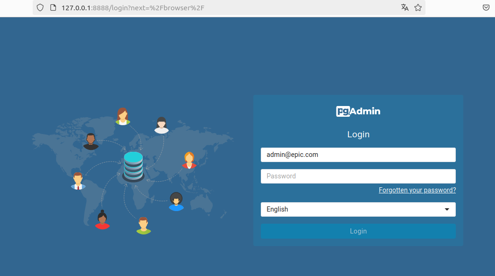

## 1. Install postgresql
### 1.1 Manual installation

####  Pull/Download Official Postgres Image From Docker Hub
``` bash
sudo docker pull postgres
```

<p align="right">(<a href="#top">back to top</a>)</p>

#### Create and Run Postgres Container

Create and run the Postgres container using the Postgres image via the 
“docker run --name -d <cont-name> -p 5432:5432 -e POSTGRES_PASSWORD=<password> postgres” command:

``` bash
sudo docker run -d --name postgresContEPIC -p 5432:5432 -e POSTGRES_PASSWORD=passwordEPIC postgres
```
Here:

- “-d” flag specifies that the container should execute in the background.
- “--name” option assigns the container’s name, i.e., “postgresContEpic”.
- “-p” assigns the port for the container i.e. “5432:5432”.
- “-e POSTGRES_PASSWORD” configures the password to be “passEPIC”.
- “postgres” is the official Docker image:

<p align="right">(<a href="#top">back to top</a>)</p>

#### Pull/Download pgAdmin4 Docker Image
``` bash
docker pull dpage/pgadmin4
```

<p align="right">(<a href="#top">back to top</a>)</p>

#### Build and Run pgAdmin4 Container

To build and execute the pgAdmin4 container, type out the 
“docker run --name <cont-name> -p 8888:80 -e 'PGADMIN_DEFAULT_EMAIL=<email>' -e 'PGADMIN_DEFAULT_PASSWORD=<password>' -d dpage/pgadmin4” command:
``` bash
sudo docker run --name pgadminEPIC -p 8888:80 -e 'PGADMIN_DEFAULT_EMAIL=admin@epic.com' -e 'PGADMIN_DEFAULT_PASSWORD=passwordEPIC' -d dpage/pgadmin4
```
Here:

- “my-pgadmin” is the container’s name.
- “-p” assigns the port for the container i.e. “8888:80”.
- “-e PGADMIN_DEFAULT_EMAIL” sets the default email to be “admin@epic.com”.
- “-e PGADMIN_DEFAULT_PASSWORD” configures the password to be “passwordEPIC”.
- “dpage/pgadmin4” is the official Docker image

<p align="right">(<a href="#top">back to top</a>)</p>

### 1.2 Use "docker compose"

All these paramters are specified in  [docker-compose.yaml](postgres-docker/docker-compose.yml) file.

a. Make sure no other copies of the containers are running first.
b. Use docker ps to list the containers and docker rm -f <ids> to remove them.
c. Start up the application stack using the docker compose up command. Add the -d flag to run everything in the background.
``` bash
docker compose up -d
```
When you run the previous command, you should see output like the following:
``` bash
lahlou@lma-pc:~/P12/postgres-docker$ sudo docker compose up -d
[+] Running 32/32
 ✔ db 14 layers [⣿⣿⣿⣿⣿⣿⣿⣿⣿⣿⣿⣿⣿⣿]      0B/0B      Pulled                                                                                         70.1s 
   ✔ e1caac4eb9d2 Pull complete                                                                                                                 12.4s 
   ✔ 7a2930f13d47 Pull complete                                                                                                                  1.7s 
   ✔ a6c49e965138 Pull complete                                                                                                                  3.8s 
   ✔ ed8dc94f857d Pull complete                                                                                                                  5.1s 
   ✔ 1f07b4807698 Pull complete                                                                                                                  7.6s 
   ✔ a776288d4030 Pull complete                                                                                                                  8.4s 
   ✔ 7cbb4adb3448 Pull complete                                                                                                                  8.9s 
   ✔ b6dbd7317d5f Pull complete                                                                                                                  9.5s 
   ✔ 52814b5dc710 Pull complete                                                                                                                 39.4s 
   ✔ b68697689b55 Pull complete                                                                                                                 21.1s 
   ✔ 6d80681e3923 Pull complete                                                                                                                 22.0s 
   ✔ 4270a9f40aee Pull complete                                                                                                                 22.9s 
   ✔ d28fa0286314 Pull complete                                                                                                                 23.3s 
   ✔ cb1ee5bc271e Pull complete                                                                                                                 24.7s 
 ✔ pgadmin 16 layers [⣿⣿⣿⣿⣿⣿⣿⣿⣿⣿⣿⣿⣿⣿⣿⣿]      0B/0B      Pulled                                                                                  74.6s 
   ✔ 4abcf2066143 Pull complete                                                                                                                  1.2s 
   ✔ 754efd662def Pull complete                                                                                                                 17.7s 
   ✔ 265ce17d4bb3 Pull complete                                                                                                                 11.0s 
   ✔ 80fa2d682dbb Pull complete                                                                                                                 11.8s 
   ✔ 5e11765c38e8 Pull complete                                                                                                                 12.7s 
   ✔ 2c34a85e8c36 Pull complete                                                                                                                 13.0s 
   ✔ f40fd58a9524 Pull complete                                                                                                                 13.3s 
   ✔ ba7f30891f18 Pull complete                                                                                                                 13.6s 
   ✔ 04b1c5f3061a Pull complete                                                                                                                 16.3s 
   ✔ fa03e2300b4d Pull complete                                                                                                                 22.8s 
   ✔ 893daf7785e2 Pull complete                                                                                                                 18.7s 
   ✔ b18333e287e5 Pull complete                                                                                                                 19.4s 
   ✔ ae9681b66bbd Pull complete                                                                                                                 20.3s 
   ✔ 6909fac68368 Pull complete                                                                                                                 66.3s 
   ✔ a310f94859b9 Pull complete                                                                                                                 24.0s 
   ✔ 123beb51130d Pull complete                                                                                                                 31.5s 
[+] Running 2/2
 ✔ Container epic_pgdb           Started                                                                                                        14.1s 
 ✔ Container pgadmin4_container  Started                                                                                                        14.3s 
```

<p align="right">(<a href="#top">back to top</a>)</p>

### 2. Verify Executing Container

Ensure that the Postgres container is built and currently executing via the given-provided command "docker ps":
``` bash
lahlou@lma-pc:~$ sudo docker ps
CONTAINER ID   IMAGE            COMMAND                  CREATED          STATUS          PORTS                                            NAMES
1d423b47af37   postgres         "docker-entrypoint.s…"   19 minutes ago   Up 18 minutes   0.0.0.0:5432->5432/tcp, :::5432->5432/tcp        epic_pgdb
87e6e8b9fbe4   dpage/pgadmin4   "/entrypoint.sh"         19 minutes ago   Up 18 minutes   443/tcp, 0.0.0.0:8888->80/tcp, :::8888->80/tcp   pgadmin4_container
```

<p align="right">(<a href="#top">back to top</a>)</p>

### 3. Interact With Executing Container

Type out the “docker exec -it <cont-name> bash” command and specify the executing Postgres container name to open the shell within it:
``` bash
sudo docker exec -it postgresContEPIC bash
```
<p align="right">(<a href="#top">back to top</a>)</p>

### 4. Connect to a PostgreSQL Database Server

Execute the “psql” command along with the hostname and user name to make a connection with the Postgres Database Server:
``` bash
psql -h localhost -U postgres
```

<p align="right">(<a href="#top">back to top</a>)</p>

### 5. Create a PostgreSQL Database

Now we are all set to create a new Postgres database. For this purpose, use/execute the “CREATE DATABASE” command along with the database name. For instance, we are creating a database named “epic”:
``` bash
CREATE DATABASE epic;
```

<p align="right">(<a href="#top">back to top</a>)</p>

### 6. Confirm Database Creation

Display all the databases to view the newly created database:

``` bash
\l
postgres=# \l
                                                      List of databases
   Name    |  Owner   | Encoding | Locale Provider |  Collate   |   Ctype    | ICU Locale | ICU Rules |   Access privileges   
-----------+----------+----------+-----------------+------------+------------+------------+-----------+-----------------------
 epic      | postgres | UTF8     | libc            | en_US.utf8 | en_US.utf8 |            |           | 
 postgres  | postgres | UTF8     | libc            | en_US.utf8 | en_US.utf8 |            |           | 
 template0 | postgres | UTF8     | libc            | en_US.utf8 | en_US.utf8 |            |           | =c/postgres          +
           |          |          |                 |            |            |            |           | postgres=CTc/postgres
 template1 | postgres | UTF8     | libc            | en_US.utf8 | en_US.utf8 |            |           | =c/postgres          +
           |          |          |                 |            |            |            |           | postgres=CTc/postgres
(4 rows)
```
It can be seen that the “epic” database has been created successfully.

<p align="right">(<a href="#top">back to top</a>)</p>

### 7. Establish a Connection With a Database

Type out the “\c” meta-command along with the database name of your choice to establish a connection with it.
For instance, we want to connect to the “epic” database:Establish a Connection With a Database
``` bash
\c epic
You are now connected to database "epic" as user "postgres".
epic=# 
```

### Access pgAdmin4 on Browser

Now, navigate to this [page](http://localhost:8888/) to access the pgAdmin4 interface and provide the required login credentials that we have configured in the previous step:
<h3 align="center">
    
    <br>
</h3>

<p align="right">(<a href="#top">back to top</a>)</p>

